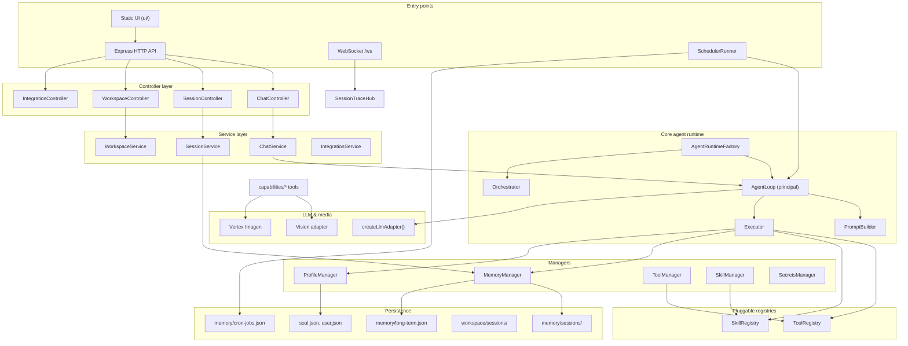
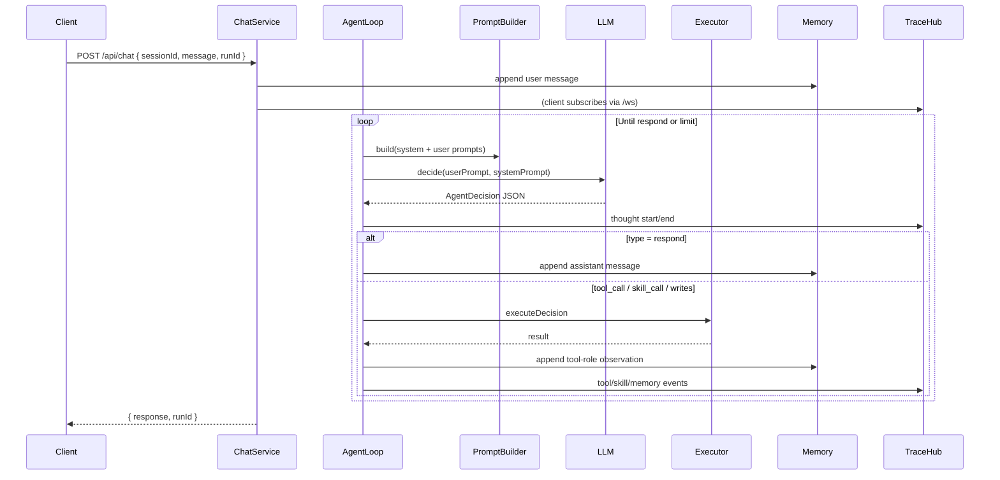

# AgentX Architecture

AgentX is a modular **hierarchical agent runtime** in Node.js + TypeScript. A **principal agent** handles user conversations and coordinates work by calling tools, invoking skills, and delegating to **isolated sub-agents**. When tasks are independent, a **DAG orchestrator** runs multiple sub-agents in parallel.

The same runtime powers the HTTP/WebSocket server (`main.ts`), the static web UI, background cron jobs, and all delegation paths (tools, agentic skills, orchestrator workers).

For setup and quick start, see [README.md](./README.md).

---

## Table of contents

1. [Architectural model](#architectural-model)
2. [Design principles](#design-principles)
3. [System overview](#system-overview)
4. [Application bootstrap](#application-bootstrap)
5. [Request lifecycle (chat)](#request-lifecycle-chat)
6. [Core agent runtime](#core-agent-runtime)
7. [Principal vs sub-agent](#principal-vs-sub-agent)
8. [Decision model](#decision-model)
9. [Tools vs skills](#tools-vs-skills)
10. [Orchestrator (parallel DAG)](#orchestrator-parallel-dag)
11. [Memory, profiles, and task plans](#memory-profiles-and-task-plans)
12. [Workspace and file handling](#workspace-and-file-handling)
13. [Prompt system](#prompt-system)
14. [Observability (WebSocket tracing)](#observability-websocket-tracing)
15. [HTTP API and UI](#http-api-and-ui)
16. [Background scheduler](#background-scheduler)
17. [LLM and media adapters](#llm-and-media-adapters)
18. [Capabilities and integrations](#capabilities-and-integrations)
19. [Extension points](#extension-points)
20. [Directory structure](#directory-structure)
21. [Environment variables](#environment-variables)

---

## Architectural model

AgentX uses a **hub-and-spoke** coordination pattern, not peer-to-peer multi-agent chat.

```
                         ┌─────────────────────────┐
                         │     User / HTTP API     │
                         └───────────┬─────────────┘
                                     │
                         ┌───────────▼─────────────┐
                         │    Principal Agent      │
                         │      (AgentLoop)        │
                         │  full tool/skill access │
                         │  can write memory       │
                         └───────────┬─────────────┘
                                     │
           ┌─────────────────────────┼─────────────────────────┐
           │                         │                         │
   ┌───────▼───────┐       ┌────────▼────────┐       ┌────────▼────────┐
   │  Direct tools │       │ Workflow skills │       │ Agentic skills  │
   │ read_file,    │       │ summarize_doc,  │       │ plan_steps,     │
   │ web_search, … │       │ resize_for_…    │       │ create_infogr…  │
   └───────────────┘       └─────────────────┘       └────────┬────────┘
                                                               │
                              ┌────────────────────────────────┤
                              │                                │
                    ┌─────────▼─────────┐          ┌───────────▼───────────┐
                    │ delegate_sub_agent│          │ orchestrate_task_graph│
                    │  (one sub-agent)  │          │  (parallel sub-agents)│
                    └─────────┬─────────┘          └───────────┬───────────┘
                              │                                │
                    ┌─────────▼─────────┐          ┌───────────▼───────────┐
                    │    Sub-agent      │          │ WorkerPool → Sub-agent│
                    │ allowlisted tools │          │   per DAG node        │
                    │ no memory writes  │          │                       │
                    └───────────────────┘          └───────────────────────┘
```

**Key properties:**

| Concept | Description |
|---------|-------------|
| **Principal agent** | The agent bound to user chat sessions. Has the full tool/skill registry and may persist memory and profiles. |
| **Sub-agent** | A separate `AgentLoop` instance with a cloned, allowlisted registry. Runs in a child session (`rootId::sub_<uuid>`). |
| **Workflow skill** | Deterministic multi-step pipeline defined in `skill.json` (`tool_call`, `llm`, `respond`, …). |
| **Agentic skill** | Delegates to a sub-agent; behavior driven by `prompt.md` and allowlisted tools. |
| **Task graph** | A validated DAG of tasks. Each node becomes a sub-agent worker when orchestrated. |
| **Task plan** | Persistent JSON plan (`task-plan.json`) that tracks status, notes, artifacts, and orchestration metadata. |

Every agent — principal or sub — uses the **same** `AgentLoop` implementation. Differences come from registry scope, `ExecutionPolicy`, and prompt context.

---

## Design principles

| Principle | Implementation |
|-----------|----------------|
| **One loop, many roles** | `AgentLoop` drives all agents. Role is determined by `AgentType`, registry clones, and execution policy. |
| **Pluggable capabilities** | Tools and skills are discovered at startup from `capabilities/` and `integrations/`. |
| **Config-first skills** | Most behavior lives in `skill.json` + optional `prompt.md`; TypeScript is optional. |
| **Session isolation** | Each chat session owns message history, workspace files, and a task plan. |
| **Sandboxed delegation** | Sub-agents cannot write long-term memory or profiles; they return results to the principal. |
| **Observable runs** | Trace events stream over WebSocket for thoughts, tools, skills, delegation, and orchestration. |
| **Structured decisions** | The LLM returns JSON decisions (`tool_call`, `skill_call`, `respond`, …), not free-form tool use. |

---

## System overview



---

## Application bootstrap

`main.ts` wires the full stack in a fixed order:

1. **Load environment** — `import "dotenv/config"`
2. **Express app** — JSON body parser, static UI (`ui/`), static workspace (`/workspace`)
3. **Managers** — `MemoryManager`, `ProfileManager`, `SecretsManager`
4. **Registries** — `ToolManager.loadAllTools()`, `SkillManager.loadAllSkills(llm)`
5. **AgentRuntimeFactory** — creates delegation tools and orchestrator; registers:
   - `delegate_sub_agent`
   - `orchestrate_task_graph`
   - `list_capabilities`
6. **Principal AgentLoop** — full registries, `AgentType.Primary`, trace hub attached
7. **SchedulerRunner** — polls cron jobs every 30s
8. **Controllers + routes** — chat, sessions, workspace uploads, Gmail OAuth
9. **WebSocket gateway** — `/ws` attached to the HTTP server

Tools named `delegate-sub-agent.ts` and `orchestrate-task-graph.ts` are **not** auto-discovered (`*.tool.ts` pattern excluded by manual registration) because they require factory-scoped dependencies.

---

## Request lifecycle (chat)



**Steps in detail:**

1. Client sends `POST /api/chat` with `{ sessionId, message, runId }`.
2. `ChatService` appends the user message. On the first message, it fire-and-forgets an LLM call to generate a short session title.
3. `AgentLoop.completeAgentRun()` registers an `AbortController` under `runId` (for `POST /api/chat/cancel`).
4. Each iteration:
   - `PromptBuilder` assembles layered prompts.
   - `LlmAdapter.decide()` returns structured JSON.
   - On `respond`, the loop ends and the assistant message is saved.
   - Otherwise `Executor` runs the action and appends a `tool`-role observation for the next iteration.
5. Iteration errors are caught, formatted as observations, and the loop continues (self-healing within the cap).
6. Outcomes: `COMPLETE`, `CANCELLED`, `TIMED_OUT`, `MAX_ITERATIONS`.

Default iteration cap for the principal agent: **50** (configurable at construction).

---

## Core agent runtime

### AgentLoop (`core/agent/agent-loop.ts`)

The universal execution engine. Responsibilities:

- Drive the **think → act → observe** cycle
- Enforce iteration caps, wall-clock deadlines, and cooperative cancellation
- Distinguish principal vs sub-agent via `AgentType`
- Emit trace events when `sessionTraceHub` and `runId` are present

**Public API:**

| Method | Returns | Purpose |
|--------|---------|---------|
| `handleUserInput(sessionId, input, options?)` | `string` | Convenience wrapper — final reply only |
| `completeAgentRun(sessionId, input, options?)` | `{ reply, outcome }` | Structured run result |
| `cancelRun(runId)` | `boolean` | Abort in-flight run by ID |

**Run options (`AgentRunHandleOptions`):**

| Field | Purpose |
|-------|---------|
| `runId` | Trace linkage + cancel registry key |
| `abortSignal` | Caller cancellation (HTTP disconnect, parent abort) |
| `deadlineAt` | Wall-clock stop timestamp |
| `maxIterations` | Per-run cap (bounded by loop constructor max) |
| `subAgentSystemPromptAppend` | Extra system prompt for sub-agents (agentic skills) |

### PromptBuilder (`core/agent/prompt-builder.ts`)

Constructs two-layer prompts on every iteration.

**System prompt includes:**

- Agent identity (`soul` profile)
- User profile
- Bootstrap state (until `bootstrap_complete` is in long-term memory)
- Full tool catalog with JSON input schemas
- Full skill catalog (tagged `[workflow]` or `[agentic]`)
- Decision format rules and examples
- Iteration guidance (converge as cap approaches)
- Sub-agent template (when `isSubAgent`) + optional `prompt.md` append

**User prompt includes:**

- Iteration counter
- Relevant long-term memory (keyword search on latest message)
- Recent session messages (capped at **20**)
- Last tool/skill observation
- Current goal framing (iteration 1 = primary instruction; later = continue from observation)

Bootstrap mode restricts certain behaviors until the user completes onboarding via the `bootstrap_finalize` skill.

### Executor (`core/agent/executor.ts`)

Dispatches `AgentDecision` by type:

| Decision type | Action |
|---------------|--------|
| `tool_call` | Look up tool in registry, run with `ToolContext` |
| `skill_call` | Run skill with rich `SkillContext` |
| `memory_write` | Persist to `long-term.json` |
| `profile_write` | Update `soul.json` or `user.json` |
| `respond` | Handled by AgentLoop before Executor |

**SkillContext** provides skills with:

- `runTool(name, input)` — indirect tool access (traced as skill-internal tools)
- `searchMemory(query)` — long-term memory search
- `writeMemory(entry)` — gated by execution policy
- `writeProfile(target, content)` — gated by execution policy
- `delegateSubAgent(params)` — same path as `delegate_sub_agent` tool

### AgentRuntimeFactory (`core/agent/agent-runtime-factory.ts`)

Central factory for delegation and orchestration:

| Export | Purpose |
|--------|---------|
| `delegateTool` | `delegate_sub_agent` — spawn one focused sub-agent |
| `orchestrateTool` | `orchestrate_task_graph` — run a DAG in parallel |
| `skillDelegateRunner` | Shared delegation callback for agentic skills |
| `orchestrator` | Lazy `Orchestrator` instance |

**Delegation flow (`runDelegatedTurn`):**

1. Parse task, tool/skill allowlists, iteration/deadline caps, optional model override
2. Create child session via `MemoryManager.createChildSession`
3. Clone allowlisted tools/skills into isolated registries
4. Optionally create a per-sub-agent LLM adapter (`createLlmAdapter({ model })`)
5. Run sub-agent `AgentLoop` with `SUB_AGENT_EXECUTION_POLICY`
6. Emit `sub_delegate` trace events (start/end + outcome)
7. Return JSON with reply, outcome, and a synthesized **execution log** (step-by-step sub-agent history)

Default sub-agent limits (`agent-runtime-constants.ts`):

| Constant | Value |
|----------|-------|
| Default max iterations | 24 |
| Hard max iterations | 48 |
| Default wall-clock | 120s |
| Hard wall-clock | 600s |

---

## Principal vs sub-agent

| Aspect | Principal | Sub-agent |
|--------|-----------|-----------|
| `AgentType` | `Primary` | `SubAgent` |
| Tool/skill registry | Full master registry | Cloned allowlist only |
| `ExecutionPolicy` | `PRIMARY_AGENT_EXECUTION_POLICY` | `SUB_AGENT_EXECUTION_POLICY` |
| Memory writes | Allowed | Blocked — return facts in reply |
| Profile writes | Allowed | Blocked |
| Bootstrap gating | Active until complete | Skipped (`isBootstrapComplete = true`) |
| Session ID | Root session UUID | `rootId::sub_<uuid>` |
| Session file location | `memory/sessions/<rootId>/session.json` | `memory/sessions/<rootId>/subs/<subId>/session.json` |
| Trace events | Full run tracer | Linked via `sub_delegate` on parent run |

Sub-agents can themselves call agentic skills or nested delegation (via `skillDelegateRunner`), but remain sandboxed at each level.

---

## Decision model

The LLM must return **one JSON object** per iteration. Gemini adapters request `responseMimeType: "application/json"`.

```json
{
  "thought": "Reasoning shown in traces",
  "type": "tool_call",
  "tool": "read_file",
  "input": { "path": "workspace/sessions/abc/workspace/uploads/doc.pdf" }
}
```

**Supported `type` values** (`common/interfaces/types.ts`):

| Type | Fields | Effect |
|------|--------|--------|
| `respond` | `message` | End loop; persist assistant message |
| `tool_call` | `tool`, `input` | Execute registered tool |
| `skill_call` | `skill`, `input` | Execute registered skill |
| `memory_write` | `memoryEntry` | Add long-term memory `{ type, content }` |
| `profile_write` | `target`, `content` | Update `soul` or `user` profile |

After non-respond decisions, AgentLoop appends a `tool`-role message:

```
Tool read_file result: { ... }
Skill summarize_document result: ...
```

---

## Tools vs skills

| | **Tools** | **Skills** |
|---|-----------|------------|
| **Definition** | TypeScript class (`*.tool.ts`) | `skill.json` + optional `prompt.md` |
| **Discovery** | `ToolManager` scans `capabilities/*/tools/` and `integrations/*/tools/` | `SkillManager` scans `capabilities/*/skills/` and `integrations/*/skills/` |
| **Invocation** | LLM `tool_call` decision | LLM `skill_call` decision |
| **Execution** | Single `run(input, context)` | Workflow steps or delegated sub-agent |
| **Composition** | Atomic operations | Multi-step flows built on tools + LLM |

### Workflow skills

Defined by a `steps` array in `skill.json`. Step types (`SkillStepType`):

| Step | Behavior |
|------|----------|
| `tool_call` | Call a tool; optional `saveAs` stores result in skill state |
| `llm` | Prompt template with `{{variable}}` substitution; uses `prompt.md` as system context |
| `memory_write` | Persist to long-term memory from template |
| `profile_write` | Update soul/user profile from JSON template |
| `respond` | Return interpolated message as skill output |

State flows through a `state` object: `{ input, lastResult, ...saveAs keys }`.

Example: `capabilities/filesystem/skills/summarize_document/` — read file → LLM summarize → respond.

### Agentic skills

`kind: "agentic"` in `skill.json`. Instead of fixed steps:

1. Build a task string from skill input JSON
2. Call `delegateSubAgent` with allowlisted `toolNames` / `skillNames`
3. Append `prompt.md` as `systemPromptAppend`
4. Optional per-skill `maxIterations`, `deadlineMs`, `model`

Examples:

| Skill | Role |
|-------|------|
| `plan_steps` | Builds ordered task plan with dependencies; uses task-plan tools |
| `create_photo_social_graphic` | Design sub-agent with image/HTML tools |
| `create_infographic` | Visual layout sub-agent |

---

## Orchestrator (parallel DAG)

Location: `core/orchestrator/`

```
TaskGraph → Scheduler → WorkerPool → EventBus
                ↑                           │
                └──── task_completed/failed ┘
```

### Components

| Component | File | Responsibility |
|-----------|------|----------------|
| **TaskGraph** | `task-graph.ts` | Validates DAG (no cycles, valid refs), tracks node status, promotes ready nodes |
| **Scheduler** | `scheduler.ts` | Event-driven dispatch; re-evaluates on completion/failure |
| **WorkerPool** | `worker-pool.ts` | Runs ready tasks concurrently; each task = one sub-agent |
| **Orchestrator** | `orchestrator.ts` | Façade; wires components, syncs task plan, emits traces |
| **EventBus** | `event-bus.ts` | `task_started`, `task_completed`, `task_failed` |

### Task node lifecycle

```
pending → ready → running → completed
                         └→ failed → (dependents skipped)
```

- **Ready**: all `depends_on` nodes are `completed`
- **Skipped**: upstream failure blocked this node
- On failure, transitive dependents are marked `skipped` (unless `failFast` stops the whole graph)

### Worker execution

Each DAG node spawns:

1. Child session (`createChildSession`)
2. Cloned tool/skill registries from `tool_names` / `skill_names`
3. Sub-agent `AgentLoop` with task instruction built from node metadata + upstream results
4. Optional `artifactPath` — worker is prompted to write output to a workspace path

The orchestrator syncs node status back to `task-plan.json` via `MemoryManager.patchTaskPlanTask`:

| Event | Plan update |
|-------|-------------|
| Task started | `status: in_progress` |
| Task completed | `status: completed`, `notes`, `artifact_path` |
| Task failed | `status: blocked`, `blocked_reason` |

### Typical planning flow

```
User request
  → principal calls plan_steps (agentic skill)
  → sub-agent writes task-plan.json via write_task_plan
  → principal calls orchestrate_task_graph
  → parallel workers execute independent nodes
  → principal synthesizes final response from orchestration summary
```

---

## Memory, profiles, and task plans

### Session memory (`MemoryManager`)

| Item | Location |
|------|----------|
| Principal session | `memory/sessions/<sessionId>/session.json` |
| Sub-agent session | `memory/sessions/<rootId>/subs/<subSessionId>/session.json` |
| Task plan | `memory/sessions/<rootId>/task-plan.json` |

**Message roles:** `user`, `assistant`, `tool`

Task plan session IDs always resolve to the root: `sessionId.split("::")[0]`.

Plan writes are serialized per root session via an internal lock map to prevent concurrent corruption.

### Long-term memory

| Item | Detail |
|------|--------|
| File | `memory/long-term.json` |
| Entry types | `user_preference`, `behavior_rule`, `fact` |
| Retrieval | Keyword search over content for prompt injection |
| Access | `search_memory` tool, `remember_fact` skill, `memory_write` decisions |

### Profiles (`ProfileManager`)

| File | Purpose |
|------|---------|
| `memory/soul.json` | Agent personality, tone, identity |
| `memory/user.json` | User name, role, preferences |

Both are injected into the principal agent's system prompt and updatable via `profile_write` or workflow skill steps.

### Task plan schema

Defined in `common/services/task-plan-schema.ts` (Zod-validated):

```typescript
{
  schemaVersion: 1,
  updatedAt: string,
  tasks: [{
    id: string,
    status: "pending" | "in_progress" | "completed" | "blocked",
    title?: string,
    notes?: string,
    artifact_path?: string,
    blocked_reason?: string,
    depends_on?: string[],
    tool_names?: string[],
    skill_names?: string[],
    instruction?: string
  }]
}
```

Tools: `read_task_plan`, `write_task_plan`, `patch_task_plan_task`.

---

## Workspace and file handling

| Mechanism | Path / route |
|-----------|--------------|
| Upload | `POST /api/session/:id/files` → `workspace/sessions/<id>/workspace/uploads/` |
| List | `GET /api/session/:id/files` |
| Static serve | `GET /workspace/...` (Express static) |
| Filesystem tools | `read_file`, `write_file`, `list_directory`, `download_file` |

Design and PDF capabilities write artifacts under the session workspace (PNGs, SVGs, PDFs, HTML intermediates).

Chat requests can include `attachmentPaths` so the agent knows which uploaded files to reference.

Paths in prompts and tools are **workspace-relative** (e.g. `workspace/sessions/<id>/workspace/uploads/doc.pdf`).

---

## Prompt system

The prompt builder enforces strict iteration semantics:

**Iteration 1** — the user message is the primary instruction; agent plans and takes first action.

**Iteration N > 1** — the last observation is primary; the original request is background context. The agent must advance one step, not restart the task.

**Near max iterations** — reduce exploration; prioritize convergence and finalization.

Sub-agent prompts add:

- Delegation framing ("you are a focused sub-agent")
- Allowlisted capability catalog (not the full registry)
- Skill-specific `prompt.md` append (agentic skills)
- No bootstrap onboarding flow

---

## Observability (WebSocket tracing)

### Gateway

- **Path:** `/ws`
- **Protocol:** JSON messages (`common/realtime/ws-protocol.ts`)

**Client → server:**

| Message | Purpose |
|---------|---------|
| `hello` | Handshake |
| `ping` / `pong` | Keepalive |
| `subscribe` | `{ sessionId }` — receive traces for session |
| `unsubscribe` | Stop receiving traces |

**Server → client:**

| Message | Purpose |
|---------|---------|
| `agent_trace` | Step event with phase, iteration, tool/skill name, text |
| `error` | Protocol or subscription errors |

### Trace hub

`SessionTraceHub` broadcasts events to all WebSocket clients subscribed to a session.

**Trace step types:**

| Step | When |
|------|------|
| `thought` | LLM decision start/end |
| `tool` | Tool execution start/end |
| `skill` | Skill execution start/end |
| `skill_tool` | Tool invoked inside a skill |
| `memory_write` | Memory persistence |
| `profile_write` | Profile update |
| `sub_delegate` | Sub-agent delegation start/end |
| Run outcome | `COMPLETE`, `CANCELLED`, `TIMED_OUT`, `MAX_ITERATIONS` |

Orchestrator task events appear as `tool` steps named `task:<taskId>`.

---

## HTTP API and UI

Server port: `PORT` env (default **3000**).

| Route | Method | Purpose |
|-------|--------|---------|
| `/` | GET | Static chat UI |
| `/workspace/*` | GET | Generated/uploaded files |
| `/api/chat` | POST | Send message; run principal agent |
| `/api/chat/cancel` | POST | Cancel run by `runId` |
| `/api/sessions` | GET | List sessions |
| `/api/sessions` | POST | Create session |
| `/api/session/:id` | GET | Message history |
| `/api/session/:id/plan` | GET | Task plan JSON |
| `/api/session/:id/files` | POST | Upload file (multipart, 25MB max) |
| `/api/session/:id/files` | GET | List uploaded files |
| `/api/auth/gmail` | GET | Start Gmail OAuth |
| `/api/auth/gmail/callback` | GET | OAuth callback |
| `/api/auth/gmail/status` | GET | Connection status |
| `/api/auth/gmail` | DELETE | Disconnect Gmail |
| `/ws` | WS | Live trace stream |

The UI (`ui/index.html`) is a minimal static client: session list, chat, message send. It subscribes to `/ws` for live agent step visibility.

---

## Background scheduler

`SchedulerRunner` (`common/services/scheduler-runner.ts`) polls every **30 seconds**.

| Item | Detail |
|------|--------|
| Storage | `memory/cron-jobs.json` |
| Tools | `upsert_cron_job`, `list_cron_jobs`, `delete_cron_job` |
| Cron format | 5-field: `minute hour day month weekday` |
| Execution | Due job's `task` string → `AgentLoop.handleUserInput` in a dedicated scheduler session |

The scheduler uses the same principal agent loop as interactive chat.

---

## LLM and media adapters

Location: `llm-adapters/`

### Text decisions (`createLlmAdapter`)

| Provider | Env | Adapter | Notes |
|----------|-----|---------|-------|
| `gemini` | `GOOGLE_CLOUD_PROJECT`, `GOOGLE_CLOUD_LOCATION`, `GEMINI_MODEL` | `GeminiVertexAdapter` | **Recommended.** JSON mode via Vertex AI. |
| `openai` | `OPENAI_API_KEY`, `OPENAI_MODEL` | `OpenAIAdapter` | |
| `ollama` | `OLLAMA_API_BASE`, `OLLAMA_MODEL` | `OllamaAdapter` | Local inference |
| `mock` | — | `MockLlmAdapter` | Default when unset; limited behavior |

`createLlmAdapter({ model })` supports per-sub-agent model overrides (agentic skills, manual delegation).

Authentication for Vertex: [Application Default Credentials](https://cloud.google.com/docs/authentication/application-default-credentials).

### Vision (`createVisionLlmAdapter`)

| Provider | Env |
|----------|-----|
| `gemini` | Reuses GCP project; `GEMINI_VISION_MODEL` or `GEMINI_MODEL` |
| `openai` | `OPENAI_API_KEY`; `OPENAI_VISION_MODEL` or `OPENAI_MODEL` |

Used by `inspect_image` and related design tools. Defaults to `VISION_PROVIDER` or falls back to `LLM_PROVIDER`.

### Image generation (`createImageGenAdapter`)

| Provider | Env |
|----------|-----|
| `vertex` | `GOOGLE_CLOUD_PROJECT`, `GOOGLE_CLOUD_LOCATION`, `IMAGEN_MODEL` |

`VertexImagenAdapter` powers `generate_image`, background removal, inpainting, and related design pipeline tools.

---

## Capabilities and integrations

### Capabilities (`capabilities/`)

Domain-owned tools and skills:

| Capability | Tools (examples) | Skills (examples) |
|------------|------------------|-------------------|
| **core** | `ask_user`, `search_memory`, `get_current_time`, task-plan tools, `delegate_sub_agent`, `orchestrate_task_graph`, `list_capabilities` | `remember_fact`, `bootstrap_finalize`, `plan_steps` |
| **filesystem** | `read_file`, `write_file`, `list_directory`, `download_file` | `summarize_document`, `extract_tasks` |
| **scheduler** | `upsert_cron_job`, `list_cron_jobs`, `delete_cron_job` | — |
| **pdf** | `read_pdf`, `generate_designed_pdf` | `generate_designed_pdf` |
| **design** | HTML/SVG render, image edit/generate, compose, crop, overlay, inspect | `create_photo_social_graphic`, `create_infographic`, `create_icon_set`, `prepare_images_for_design`, `resize_for_platforms` |
| **rag** | `index_document`, `ask_document` | `qa_document` |

### Integrations (`integrations/`)

External service connectors:

| Integration | Tools | Auth / config |
|-------------|-------|---------------|
| **gmail** | `list_emails`, `read_email`, `search_emails` | OAuth via `SecretsManager` + `/api/auth/gmail` |
| **web-search** | `web_search` | `TAVILY_API_KEY` |
| **unsplash** | `search_stock_images` | `UNSPLASH_ACCESS_KEY` |

### Registration rules

- **Auto-discovered tools:** any `*.tool.ts` under `capabilities/*/tools/` or `integrations/*/tools/`
- **Manually registered tools:** `delegate_sub_agent`, `orchestrate_task_graph`, `list_capabilities` (require runtime factory deps)
- **Skills:** any folder with `skill.json` under `capabilities/*/skills/` or `integrations/*/skills/`

Broken tool files are silently skipped during discovery (logged internally).

---

## Extension points

| Extension | How |
|-----------|-----|
| **New LLM provider** | Implement `LlmAdapter`; register in `llm-adapters/factory.ts` |
| **New tool** | Add `capabilities/<domain>/tools/my-tool.tool.ts` with `name`, `description`, `inputSchema?`, `run()` |
| **New skill** | Add `capabilities/<domain>/skills/my_skill/skill.json` (+ `prompt.md`); set `kind: workflow \| agentic` |
| **New integration** | Add `integrations/<service>/tools/`; optional OAuth in controllers |
| **Custom execution policy** | Pass `executionPolicy` when constructing `AgentLoop` |
| **Sub-agent specialization** | Whitelist tools/skills; append `prompt.md`; optional model override |
| **Orchestrator tuning** | Pass `OrchestratorConfig` (`failFast`, worker pool limits) |

Config-first skills are the default path. TypeScript skill overrides are reserved for cases where JSON steps are insufficient.

---

## Directory structure

```text
AgentX/
├── main.ts                         # HTTP + WebSocket bootstrap
├── core/
│   ├── agent/
│   │   ├── agent-loop.ts           # Universal iteration engine
│   │   ├── executor.ts             # Decision dispatch
│   │   ├── prompt-builder.ts       # Layered prompt assembly
│   │   ├── agent-runtime-factory.ts# Delegation + orchestration wiring
│   │   ├── execution-policy.ts     # Principal vs sub-agent permissions
│   │   └── sub-agent-registry.ts   # Tool/skill whitelist cloning
│   ├── skills/
│   │   ├── skill-loader.ts         # Discovery + workflow/agentic dispatch
│   │   ├── workflow-skill-runner.ts
│   │   └── agentic-skill-runner.ts
│   └── orchestrator/
│       ├── orchestrator.ts         # DAG façade
│       ├── task-graph.ts           # DAG validation + status
│       ├── scheduler.ts            # Ready-task dispatch
│       ├── worker-pool.ts          # Parallel sub-agent workers
│       └── event-bus.ts
├── capabilities/                   # Domain tools + skills
├── integrations/                   # External service connectors
├── controllers/                    # HTTP controllers + services
├── managers/
│   ├── memory-manager.ts
│   ├── profile-manager.ts
│   ├── tool-manager.ts
│   ├── skill-manager.ts
│   └── secrets-manager.ts
├── llm-adapters/                   # Gemini, OpenAI, Ollama, Imagen, mock
├── common/
│   ├── interfaces/                 # Types, registries
│   ├── services/                   # Workspace, task-plan, scheduler, images, …
│   └── realtime/                   # WebSocket gateway, trace hub, protocol
├── memory/
│   ├── sessions/                   # Per-session JSON + task plans + subs/
│   ├── long-term.json
│   ├── soul.json
│   └── user.json
├── workspace/sessions/             # Uploads + generated artifacts
├── ui/                             # Static web UI
└── secrets/                        # Integration credentials (gitignored)
```

---

## Environment variables

| Variable | Purpose |
|----------|---------|
| `LLM_PROVIDER` | `gemini`, `openai`, `ollama`, or `mock` |
| `GOOGLE_CLOUD_PROJECT` | GCP project for Vertex Gemini + Imagen |
| `GOOGLE_CLOUD_LOCATION` | Vertex region (default `us-central1`) |
| `GEMINI_MODEL` | Primary Gemini model |
| `GEMINI_VISION_MODEL` | Optional vision model override |
| `OPENAI_API_KEY` / `OPENAI_MODEL` | OpenAI text |
| `OPENAI_VISION_MODEL` | OpenAI vision override |
| `OLLAMA_API_BASE` / `OLLAMA_MODEL` | Local Ollama |
| `VISION_PROVIDER` | `gemini` or `openai` |
| `IMAGE_GEN_PROVIDER` | `vertex` (default) |
| `IMAGEN_MODEL` | Vertex Imagen model |
| `TAVILY_API_KEY` | Web search |
| `GMAIL_CLIENT_ID` / `GMAIL_CLIENT_SECRET` / `GMAIL_REFRESH_TOKEN` | Gmail OAuth |
| `UNSPLASH_ACCESS_KEY` | Stock image search |
| `APP_BASE_URL` | Base URL for OAuth redirects and workspace links in prompts |
| `PORT` | HTTP server port (default 3000) |

See [.env.example](./.env.example) for a copy-paste template.

---

## Related reading

- [README.md](./README.md) — quick start, setup, capability overview
- `capabilities/*/skills/*/skill.json` — concrete skill definitions
- `capabilities/*/skills/*/prompt.md` — agentic skill behavior specs
